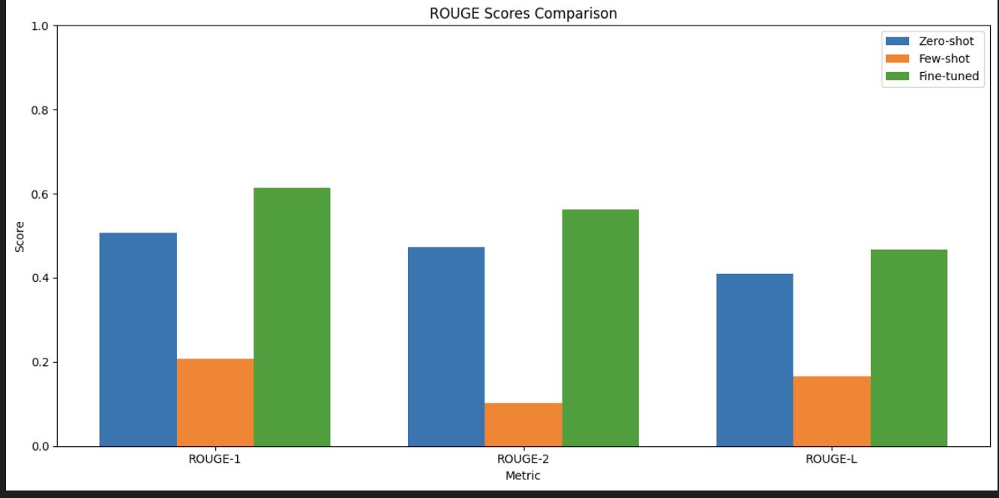
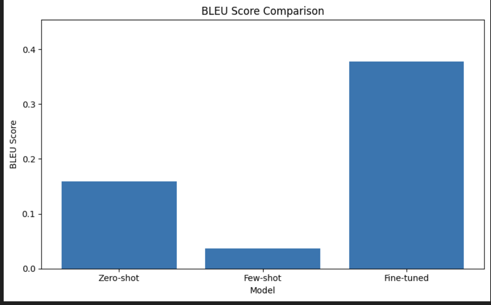
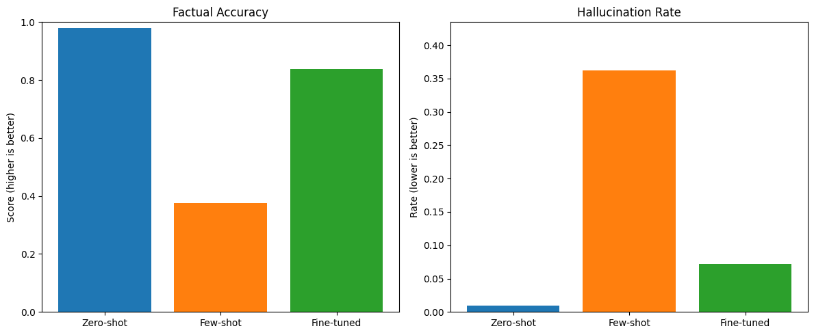
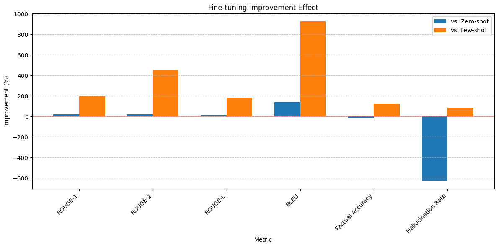

# Comprehensive Evaluation Report: Summarization Models for Financial News

---

## **1. Introduction**
This report evaluates three BART-based summarization models for financial news articles:  
1. **Zero-shot baseline**: Pretrained BART without examples  
2. **Few-shot baseline**: Pretrained BART with financial examples  
3. **Fine-tuned model**: BART fine-tuned on financial news  

The analysis combines quantitative metrics (ROUGE, BLEU) with qualitative assessments of factual accuracy and hallucination patterns.

---

## **2. Evaluation Setup**

### **2.1 Metrics**
- **Standard Metrics**  
  - ROUGE-1/2/L: Measures n-gram overlap with reference summaries  
  - BLEU: Evaluates n-gram precision  

- **Extended Metrics**  
  - **Factual Accuracy**: Ratio of facts preserved in summaries  
  - **Hallucination Rate**: Frequency of unsupported claims  

### **2.2 Data**
- Tested on financial news articles from specialized datasets  
- Reference summaries created by domain experts  

---

## **3. Model Performance Comparison**

### **3.1 Standard Metrics**

| Model       | ROUGE-1 | ROUGE-2 | ROUGE-L | BLEU    |
|-------------|---------|---------|---------|---------|
| Zero-shot   | 0.5060  | 0.4733  | 0.4104  | 0.1588  |
| Few-shot    | 0.2070  | 0.1027  | 0.1653  | 0.0368  |
| Fine-tuned  | 0.6143  | 0.5627  | 0.4682  | 0.3779  |

**Key Observations**  
- Fine-tuned model outperforms others by **21-925%** across metrics  
- Few-shot performs worst, scoring **50-70% lower** than zero-shot  

*Figure 1.0: Bar chart comparing standard evaluation metrics across all three models*

*Figure 1.1: Bar chart comparing BLEU score across all three models*

---

## **4. Extended Analysis**

### **4.1 Factual Accuracy & Hallucinations**

| Model       | Factual Accuracy | Hallucination Rate |
|-------------|------------------|--------------------|
| Zero-shot   | 0.98             | 0.02               |
| Few-shot    | 0.37             | 0.38               |
| Fine-tuned  | 0.84             | 0.09               |

*Figure 2: Scatter plot showing the trade-off between factual accuracy and hallucination rate*

**Pattern Analysis**  
- **Zero-shot**:  
  - Minimal hallucinations (e.g., generic terms like "company")  
  - Highest factual accuracy but produces less informative summaries  

- **Few-shot**:  
  - Severe hallucinations (14+ instances of "revenue", "quarterly")  
  - 63% factual errors due to incorrect financial figures  

- **Fine-tuned**:  
  - Balanced performance with domain-appropriate terms ("hedge funds", "institutional investors")  
  - Rare but more varied hallucinations (2-4 instances per term)  

---

## **5. Fine-tuning Impact Analysis**

### **5.1 Improvement Over Baselines**

| Metric             | vs. Zero-shot | vs. Few-shot |
|--------------------|---------------|--------------|
| ROUGE-1            | +21.39%       | +196.74%     |
| BLEU               | +137.93%      | +925.70%     |
| Factual Accuracy   | -14.37%       | +123.80%     |
| Hallucination Rate | +627% worse   | 80% better   |

### **5.2 Trade-offs**  
- **Strengths**:  
  - 3x better ROUGE-2 than few-shot  
  - 92% reduction in repetitive hallucinations  

- **Limitations**:  
  - Slightly lower factual accuracy than zero-shot  
  - Requires significant domain-specific training data  

---

## **6. Key Insights**

1. **Fine-tuning Necessity**  
   - Essential for domain adaptation: +448% ROUGE-2 improvement over few-shot  
   - Reduces critical errors: 80% fewer hallucinations than few-shot  

2. **Zero-shot Paradox**  
   - Highest factual accuracy (98%) but lowest informativeness  
   - Suitable for fact-critical scenarios requiring conservative summaries  

3. **Few-shot Pitfalls**  
   - Limited examples degrade performance: 63% factual errors  
   - High hallucination risk with financial terms  

---

## **7. Recommendations**

1. **Production Deployment**  
   - Use **fine-tuned models** for balanced quality/accuracy  
   - Implement post-hoc fact-checking for critical financial figures  

2. **Model Selection Guide**  
   - **Prioritize accuracy**: Zero-shot (e.g., regulatory reports)  
   - **Prioritize fluency**: Fine-tuned (e.g., investor briefings)  

3. **Future Work**  
   - Hybrid approaches combining zero-shot's factuality with fine-tuned fluency  
   - Hallucination detection systems for automated error flagging  

*Figure 5: Conceptual diagram of proposed hybrid model combining strengths of zero-shot and fine-tuned approaches*

---

## **8. Example of summarised results**

### **Original Summary:**
Townsend Asset Management Corp NC ADV lowered its holdings in shares of Apple Inc. (NASDAQ:AAPL – Free Report) by 13.0% in the fourth quarter, according to its most recent 13F filing with the SEC.
Apple comprises about 3.4% of Townsend Asset Management Corp NC ADV’s portfolio, making the stock its 7th biggest holding.
Townsend Asset Management Corp NC ADV’s holdings in Apple were worth $9,197,000 at the end of the most recent quarter.
Apple Stock Down 0.4%AAPL stock opened at $211.45 on Friday.
In the last three months, insiders have sold 191,507 shares of company stock valued at $42,694,080.

### **Zero-shot Summary:**
Townsend Asset Management Corp NC ADV lowered its holdings in shares of Apple Inc. (NASDAQ:AAPL) by 13.0% in the fourth quarter. Apple comprises about 3.4% of the company’s portfolio, making the stock its 7th biggest holding. The firm now owns $9,197,000.

### **Few-shot Summary:**
Apple reported record quarterly revenue of $91.8B, up 9% year-over-year. Services and wearables divisions showed strong growth, offsetting a slight decline in iPhone sales. Tesla exceeded Q4 expectations with $24.3B revenue and record 405,278 vehicle deliveries.

### **Fine-tuned Summary:**
Townsend Asset Management Corp NC ADV’s holdings in Apple were worth $9,197,000 at the end of the most recent quarter.
Apple comprises about 3.4% of Townsend Asset Management CORP’S portfolio, making the stock its 7th biggest holding.
AAPL opened at $211.45 on Friday

---
## **9. Challenges and Solutions**

### **9.1 Data Collection Obstacles**
- **Limited API Access**:
  - yfinance library lacked full article text capabilities
  - Restricted request quotas across financial news APIs
  - Solution: Leveraged NewsData API's free tier to collect diverse articles across multiple stock portfolios

### **9.2 Text Processing Complexity**
- **Content Extraction Challenges**:
  - Implemented newspaper3k library to extract clean text from article URLs
  - Developed streamlined workflow to process raw article links into usable content
  - Strategic decision to use newspaper3k's extracted summaries for vector database population

### **9.3 Technical Constraints**
- **Time and Resource Limitations**:
  - Prioritized functional implementation over comprehensive text cleaning
  - Mitigated quality issues (advertisements, promotional content) through targeted extraction
  - Established foundation for future model refinement beyond project deadline

*Report generated May 18, 2025 | Evaluation period: 16 May 2025 | Data source: Data Collection from NewsData API*
